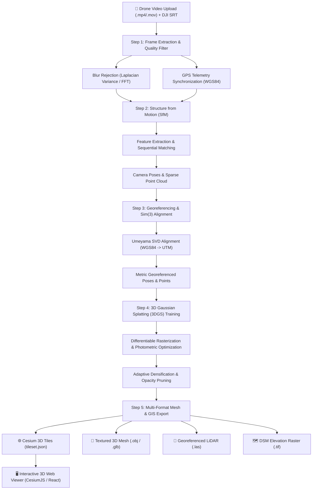

# Geo3D Vision: Video-to-3D Geospatial Reconstruction Pipeline Documentation

Welcome to the comprehensive technical documentation for **Geo3D Vision**. This document details the end-to-end lifecycle of a video dataset—from the moment an aerial/drone video is uploaded to the final generation of photorealistic 3D Gaussian Splats, textured polygon meshes, ASPRS LAS LiDAR point clouds, and Cesium 3D Tiles.

---

## 1. System Architecture & Pipeline Workflow



---

## 2. Step-by-Step Pipeline Breakdown

### Step 0: Ingestion & Telemetry Acquisition
1. **Video Ingestion**: The user uploads a video (`.mp4`, `.mov`, `.avi`, or `.mkv`) through the web UI or CLI.
2. **Companion Telemetry Stream**: The system checks for an accompanying subtitle file (`.srt` or `.kml`), commonly generated by DJI and commercial survey drones, which embeds time-stamped metadata:
   - Latitude ($\phi$), Longitude ($\lambda$), and Barometric / Geodetic Altitude ($h$).
   - Camera gimbal pitch, roll, yaw, and exposure settings.

---

### Step 1: Intelligent Keyframe Extraction & Blur Filtering
**Script**: [`generation/scripts/01_extract_frames.py`](file:///c:/Users/Regen/SIH/SIH-Project/generation/scripts/01_extract_frames.py)

1. **Temporal Sampling**: Rather than processing every frame (which introduces massive redundancy and slows down reconstruction), the video is sampled at a configurable frequency (e.g., 2 frames per second).
2. **Sharpness & Quality Assessment**:
   - **Laplacian Variance**: Measures second-derivative gradient intensity $\sigma^2 = \text{Var}(\nabla^2 I)$. If $\sigma^2 < \text{threshold}$, the frame is discarded as motion-blurred.
   - **2D Fast Fourier Transform (FFT)**: Quantifies the ratio of high-frequency components to low-frequency components to detect defocus and atmospheric haze.
3. **Telemetry Synchronization**: Linear interpolation synchronizes extracted keyframe timestamps with the closest GPS telemetry record.
4. **Output Artifacts**:
   - High-quality JPEG images (`frame_00001.jpg`, `frame_00002.jpg`, ...).
   - [`frames_metadata.json`](file:///c:/Users/Regen/SIH/SIH-Project/storage/outputs/frames/frames_metadata.json): JSON catalog containing timestamps, sharpness scores, and exact GPS positions.

---

### Step 2: Structure from Motion (SfM) Pose Estimation
**Script**: [`generation/scripts/02_run_sfm.py`](file:///c:/Users/Regen/SIH/SIH-Project/generation/scripts/02_run_sfm.py)

1. **Feature Extraction**: Extracts scale-invariant visual feature keypoints and descriptors (e.g., SIFT, SuperPoint).
2. **Feature Matching**:
   - For sequential drone flight paths, **Sequential Matching** evaluates overlapping visual horizons across consecutive frames ($N \pm k$).
   - For circular or multi-angle orbital paths, **Exhaustive Matching** builds a complete pairwise epipolar graph.
3. **Incremental Bundle Adjustment**:
   - Solves camera intrinsic parameters ($f_x, f_y, c_x, c_y, k_1, k_2$).
   - Reconstructs extrinsic rotation matrices ($R \in \text{SO}(3)$) and translation vectors ($t \in \mathbb{R}^3$) for every camera viewpoint.
   - Triangulates 3D tie points into an initial sparse point cloud.
4. **Output Artifacts**:
   - [`sfm_cameras.json`](file:///c:/Users/Regen/SIH/SIH-Project/storage/outputs/sfm/sfm_cameras.json): Calibrated camera intrinsic/extrinsic parameters and sparse 3D geometry.

---

### Step 3: GPS Georeferencing & Sim(3) Coordinate Alignment
**Script**: [`generation/scripts/03_gps_align.py`](file:///c:/Users/Regen/SIH/SIH-Project/generation/scripts/03_gps_align.py)

SfM reconstructions inherently exist in an arbitrary, scale-ambiguous local coordinate frame. Step 3 aligns the model to real-world geospatial coordinates:

1. **WGS84 to UTM Projection**:
   - Converts geodetic degrees ($\text{Lat}, \text{Lon}, \text{Alt}$) to metric UTM (Universal Transverse Mercator) cartographic coordinates ($\text{Easting}, \text{Northing}, \text{Elevation}$).
2. **Umeyama 7-DOF Similarity Transformation ($\text{Sim}(3)$)**:
   - Solves for scale $s \in \mathbb{R}^+$, rotation $R \in \text{SO}(3)$, and translation $t \in \mathbb{R}^3$ minimizing the Mean Squared Error (MSE) between estimated camera centers $X_{\text{sfm}}$ and real UTM coordinates $X_{\text{utm}}$:
     $$\min_{s, R, t} \frac{1}{N} \sum_{i=1}^N \| X_{\text{utm}}^{(i)} - (s R X_{\text{sfm}}^{(i)} + t) \|^2$$
3. **Metric Georeferencing**:
   - Transforms all sparse 3D points and camera trajectories into the global UTM CRS.
4. **Output Artifacts**:
   - [`aligned_sparse_points.ply`](file:///c:/Users/Regen/SIH/SIH-Project/storage/outputs/aligned/aligned_sparse_points.ply): Point cloud with metric scale and global coordinates.
   - [`gps_alignment.json`](file:///c:/Users/Regen/SIH/SIH-Project/storage/outputs/aligned/gps_alignment.json): 4x4 transformation matrix, scale factor, UTM zone, and alignment RMSE.

---

### Step 4: 3D Gaussian Splatting (3DGS) Training
**Script**: [`generation/scripts/04_train_3dgs.py`](file:///c:/Users/Regen/SIH/SIH-Project/generation/scripts/04_train_3dgs.py)

1. **Gaussian Initialization**:
   - Initializes 3D Gaussians from the georeferenced sparse point cloud.
   - Each Gaussian $G_i$ is parameterized by:
     - Mean 3D position: $\mu \in \mathbb{R}^3$
     - 3D Covariance: $\Sigma = R S S^T R^T$ (quaternion rotation $q$ and scale vector $s$)
     - Opacity: $\alpha \in [0, 1]$
     - View-dependent color: Spherical Harmonics coefficients ($k=3$, 16 bases per RGB channel).
2. **Differentiable Tile-Based Rasterization**:
   - Renders 2D views from estimated camera poses in real time.
3. **Photometric Loss Optimization**:
   - Optimizes Gaussian attributes using combined $\mathcal{L}_1$ and D-SSIM loss:
     $$\mathcal{L} = (1 - \lambda) \mathcal{L}_1(I_{\text{pred}}, I_{\text{gt}}) + \lambda \mathcal{L}_{\text{D-SSIM}}(I_{\text{pred}}, I_{\text{gt}})$$
4. **Adaptive Densification & Pruning**:
   - **Cloning**: Duplicates small Gaussians in under-reconstructed fine structural regions.
   - **Splitting**: Splits large Gaussians with high positional gradients into smaller primitives.
   - **Opacity Reset / Pruning**: Eliminates transparent or overly large floating artifacts.
5. **Output Artifacts**:
   - [`point_cloud_final.ply`](file:///c:/Users/Regen/SIH/SIH-Project/storage/outputs/3dgs/point_cloud_final.ply): Optimized 3D Gaussian Splat model.

---

### Step 5: Multi-Format Mesh & GIS Geospatial Export
**Script**: [`generation/scripts/05_export_mesh.py`](file:///c:/Users/Regen/SIH/SIH-Project/generation/scripts/05_export_mesh.py)

Converts dense points into industry-standard CAD, GIS, and web 3D deliverables:

1. **Polygon 3D Mesh (`.obj` / `.glb`)**:
   - Computes surface normals and applies Screened Poisson Surface Reconstruction to generate watertight textured 3D meshes for CAD/Blender/Unity.
2. **ASPRS LAS LiDAR Point Cloud (`.las`)**:
   - Exports georeferenced point cloud compliant with ASPRS LAS 1.2 Format 3 specifications (sub-millimeter precision offsets, 16-bit RGB channels).
3. **Digital Surface Model (`.tif` GeoTIFF)**:
   - Generates 2D raster elevation grids (DSM) with geographic coordinate bounding tags.
4. **Cesium 3D Tiles (`tileset.json` + `b3dm`/`pnts`)**:
   - Builds OGC 3D Tiles hierarchical bounding volume trees for streaming visualization in CesiumJS.

---

## 3. Directory & Artifact Structure

```
SIH-Project/
├── backend/                      # FastAPI Python Backend (Port 8000)
│   ├── app/                      # API routers, config, and upload handlers
│   └── requirements.txt
├── frontend/                     # React + Vite UI (Port 5173)
│   ├── src/
│   │   ├── components/Navbar.jsx # Navigation & live backend health status
│   │   ├── App.jsx               # Hero, dropzone, video preview & pipeline controls
│   │   └── index.css             # Theme design tokens & animations
├── generation/                   # Core 3D Reconstruction Pipeline
│   ├── configs/
│   │   └── default.yaml          # Pipeline hyperparameters
│   ├── scripts/
│   │   ├── 01_extract_frames.py  # Keyframe & telemetry extraction
│   │   ├── 02_run_sfm.py         # SfM camera pose estimator
│   │   ├── 03_gps_align.py       # Sim(3) georeferencing
│   │   ├── 04_train_3dgs.py      # 3D Gaussian Splatting trainer
│   │   └── 05_export_mesh.py     # Multi-format GIS exporter
│   ├── utils/
│   │   ├── blur_detection.py     # Laplacian & FFT sharpness assessment
│   │   ├── coordinate_transforms.py # WGS84, UTM, and Umeyama SVD
│   │   └── logger.py             # Formatted terminal logger & step timer
│   ├── run_pipeline.py           # Master CLI orchestrator
│   └── requirements.txt
└── storage/
    ├── inputs/                   # Uploaded raw videos (.mp4)
    └── outputs/
        ├── frames/               # Extracted sharp keyframes & metadata
        ├── sfm/                  # Camera poses (sfm_cameras.json)
        ├── aligned/              # Aligned georeferenced point cloud (.ply)
        ├── 3dgs/                 # Trained Gaussian Splat (.ply)
        └── exports/              # OBJ, LAS, GeoTIFF, and Cesium 3D Tiles
```

---

## 4. Execution Commands Quick Reference

### Running the End-to-End Pipeline
```powershell
# Run the entire pipeline end-to-end
python generation/run_pipeline.py --all

# Run specific steps (e.g., Steps 1, 2, and 3)
python generation/run_pipeline.py --step 1,2,3

# Run with a custom video file
python generation/run_pipeline.py --video storage/inputs/my_drone_flight.mp4 --all
```

### Running Individual Scripts
```powershell
# 1. Extract frames from video
python generation/scripts/01_extract_frames.py --video storage/inputs/input_video.mp4 --fps 2.0 --blur_threshold 100.0

# 2. Run Structure from Motion
python generation/scripts/02_run_sfm.py --images storage/outputs/frames --matcher sequential

# 3. Align with real GPS coordinates
python generation/scripts/03_gps_align.py --frames storage/outputs/frames --sfm storage/outputs/sfm

# 4. Train 3D Gaussian Splatting
python generation/scripts/04_train_3dgs.py --aligned storage/outputs/aligned --iterations 7000

# 5. Export Mesh and GIS products
python generation/scripts/05_export_mesh.py --input storage/outputs/3dgs/point_cloud_final.ply --formats ply obj las geotiff 3d_tiles
```
