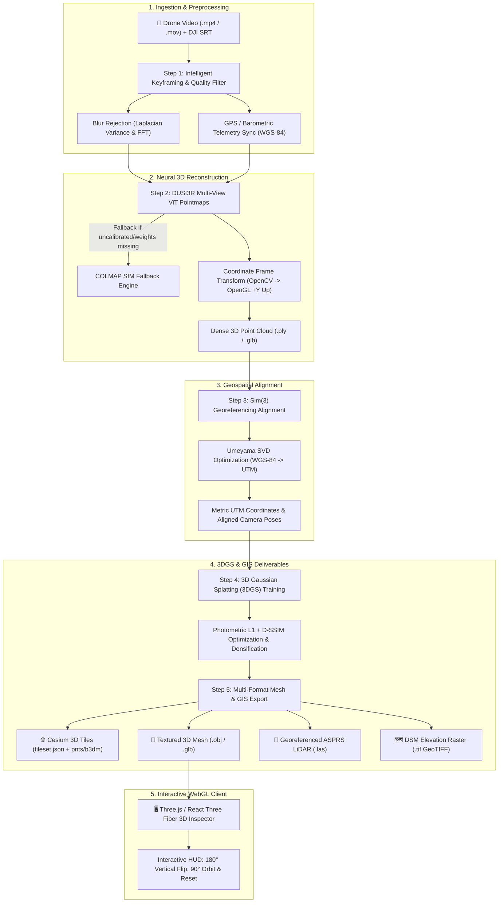

# Geo3D Vision: Video-to-3D Geospatial Reconstruction Pipeline Documentation

Welcome to the comprehensive technical documentation for **Geo3D Vision**. This document details the end-to-end lifecycle of drone video datasets—from the moment aerial footage and DJI telemetry are uploaded, through neural 3D reconstruction (DUSt3R & 3D Gaussian Splatting), to interactive full-screen WebGL inspection and GIS-standard deliverables (ASPRS LAS, GeoTIFF, OGC 3D Tiles).

---

## 1. System Architecture & Pipeline Workflow


```mermaid
flowchart TD
    subgraph INGESTION["1. Ingestion & Preprocessing"]
        A["🎥 Drone Video (.mp4 / .mov) + DJI SRT"] --> B["Step 1: Intelligent Keyframing & Quality Filter"]
        B --> C["Blur Rejection (Laplacian Variance & FFT)"]
        B --> D["GPS / Barometric Telemetry Sync (WGS-84)"]
    end

    subgraph RECONSTRUCTION["2. Neural 3D Reconstruction"]
        C --> E["Step 2: DUSt3R Multi-View ViT Pointmaps"]
        D --> E
        E -->|Fallback if uncalibrated/weights missing| SFM["COLMAP SfM Fallback Engine"]
        E --> F["Coordinate Frame Transform (OpenCV -> OpenGL +Y Up)"]
        F --> G["Dense 3D Point Cloud (.ply / .glb)"]
    end

    subgraph GEOREFERENCING["3. Geospatial Alignment"]
        G --> H["Step 3: Sim(3) Georeferencing Alignment"]
        H --> I["Umeyama SVD Optimization (WGS-84 -> UTM)"]
        I --> J["Metric UTM Coordinates & Aligned Camera Poses"]
    end

    subgraph RENDERING_EXPORT["4. 3DGS & GIS Deliverables"]
        J --> K["Step 4: 3D Gaussian Splatting (3DGS) Training"]
        K --> L["Photometric L1 + D-SSIM Optimization & Densification"]
        L --> M["Step 5: Multi-Format Mesh & GIS Export"]
        M --> O1["🌐 Cesium 3D Tiles (tileset.json + pnts/b3dm)"]
        M --> O2["📐 Textured 3D Mesh (.obj / .glb)"]
        M --> O3["📡 Georeferenced ASPRS LiDAR (.las)"]
        M --> O4["🗺️ DSM Elevation Raster (.tif GeoTIFF)"]
    end

    subgraph VIEWPORT["5. Interactive WebGL Client"]
        O2 --> P["🖥️ Three.js / React Three Fiber 3D Inspector"]
        P --> Q["Interactive HUD: 180° Vertical Flip, 90° Orbit & Reset"]
    end
```

---

## 2. Pipeline Milestones & Progress Tracking

The platform visualizes live processing status across the frontend via WebSocket and HTTP polling. The stages synchronize directly with the backend and reconstruction pipeline:

| Progress Threshold | Pipeline Milestone | Description | Component Icon |
| :---: | :--- | :--- | :---: |
| **15%** | **Extracting frames & telemetry** | Motion-compensated keyframing, blur rejection, and DJI SRT timestamp alignment. | `Video` |
| **30%** | **Running DUSt3R 3D reconstruction** | Feedforward cross-attention ViT dense point cloud and depth map regression. | `Layers` |
| **55%** | **Optimizing camera poses & alignment** | Umeyama $\text{Sim}(3)$ SVD transformation to global UTM geospatial coordinates. | `Compass` |
| **75%** | **Training 3D Gaussian Splatting model** | Differentiable tile rasterization, adaptive cloning, splitting, and opacity pruning. | `Cpu` |
| **90%** | **Poisson mesh reconstruction & GLB export** | Screened Poisson surface reconstruction, LAS LiDAR export, and GLB web optimization. | `Box` |

---

## 3. Step-by-Step Technical Deep Dive

### Step 1: Intelligent Keyframing & Telemetry Parsing
**Script**: [`generation/scripts/01_extract_frames.py`](file:///c:/Users/Regen/SIH/SIH-Project/generation/scripts/01_extract_frames.py)

1. **Temporal Adaptive Sampling**:
   - Samples input drone video at a configurable rate (default `2.0 FPS`) to eliminate inter-frame redundancy while maintaining sufficient baseline overlap.
2. **Sharpness & Quality Filtering**:
   - **Laplacian Variance**: Evaluates high-frequency image gradients $\sigma^2 = \text{Var}(\nabla^2 I)$. Frames below the blur threshold (e.g. during sudden yaw turns or gimbal tilts) are pruned automatically.
   - **Fast Fourier Transform (FFT)**: Computes radial energy distribution to detect defocus blur and atmospheric haze.
3. **DJI Telemetry Synchronization**:
   - Extracts ISO 6709 coordinates, altitude, gimbal pitch, roll, and yaw from accompanying `.srt` or `.kml` flight logs, interpolating timestamps to each frame.
4. **Artifacts**:
   - Sharp keyframe images (`frame_00001.jpg`, `frame_00002.jpg`, ...)
   - `frames_metadata.json`: Catalog of timestamps, blur metrics, and geodetic coordinates.

---

### Step 2: DUSt3R Neural Multi-View 3D Reconstruction
**Script**: [`generation/dust3r/run_dust3r_recon.py`](file:///c:/Users/Regen/SIH/SIH-Project/generation/dust3r/run_dust3r_recon.py)  
**Fallback Engine**: [`generation/scripts/02_run_sfm.py`](file:///c:/Users/Regen/SIH/SIH-Project/generation/scripts/02_run_sfm.py) (COLMAP SfM)

1. **Direct Pointmap Regression**:
   - Operates directly on uncalibrated image pairs using a Vision Transformer (ViT) architecture with cross-attention decoders (`DUSt3R_ViTLarge_BaseDecoder_512_dpt.pth`).
   - Does **not** require manual camera calibration, known focal lengths, or preliminary feature matching graph construction.
2. **Global Coordinate Transformation (+Y Upright Mapping)**:
   - DUSt3R outputs 3D points in the standard **OpenCV camera coordinate convention** ($+X$ right, $+Y$ down, $+Z$ forward).
   - In standard 3D WebGL / GLTF / OpenGL world coordinates, $+Y$ points **up** towards the sky.
   - The reconstruction pipeline automatically applies a $180^\circ$ rotation around the X-axis:
     $$Y \leftarrow -Y, \quad Z \leftarrow -Z$$
     This guarantees mountain peaks and terrain features point upright into positive $Y$ without chirality inversion or mirroring.
3. **Artifacts**:
   - `model.ply`: Dense colored 3D point cloud.
   - `model.glb`: Optimized binary GLTF point cloud asset for instant WebGL loading.

---

### Step 3: GPS Georeferencing & Sim(3) Alignment
**Script**: [`generation/scripts/03_gps_align.py`](file:///c:/Users/Regen/SIH/SIH-Project/generation/scripts/03_gps_align.py)

1. **WGS-84 to UTM Projection**:
   - Transforms geodetic coordinates ($\text{Latitude}, \text{Longitude}, \text{Altitude}$) to metric cartographic UTM coordinates ($\text{Easting}, \text{Northing}, \text{Elevation}$).
2. **Umeyama 7-DOF Similarity Transformation ($\text{Sim}(3)$)**:
   - Solves for optimal uniform scale $s$, rotation $R \in \text{SO}(3)$, and translation vector $t \in \mathbb{R}^3$ via Singular Value Decomposition (SVD):
     $$\min_{s, R, t} \frac{1}{N} \sum_{i=1}^N \| X_{\text{utm}}^{(i)} - (s R X_{\text{camera}}^{(i)} + t) \|^2$$
3. **Artifacts**:
   - `aligned_sparse_points.ply`: Metric-scaled, georeferenced point cloud.
   - `gps_alignment.json`: Transformation matrices, scale factor, UTM zone, and alignment RMSE.

---

### Step 4: 3D Gaussian Splatting (3DGS) Training
**Script**: [`generation/scripts/04_train_3dgs.py`](file:///c:/Users/Regen/SIH/SIH-Project/generation/scripts/04_train_3dgs.py)

1. **Point Cloud Seeding**:
   - Seeds initial Gaussians directly from the DUSt3R dense point cloud.
   - Each Gaussian primitive is parameterized by position $\mu \in \mathbb{R}^3$, covariance matrix $\Sigma = R S S^T R^T$, opacity $\alpha$, and spherical harmonics color coefficients.
2. **Differentiable Tile Rasterization**:
   - Renders 2D views from estimated camera trajectories at high frame rates.
3. **Loss Function Optimization**:
   - Optimizes Gaussian attributes using a composite $\mathcal{L}_1$ and structural similarity ($\mathcal{L}_{\text{D-SSIM}}$) loss:
     $$\mathcal{L} = (1 - \lambda) \mathcal{L}_1(I_{\text{pred}}, I_{\text{gt}}) + \lambda \mathcal{L}_{\text{D-SSIM}}(I_{\text{pred}}, I_{\text{gt}})$$
4. **Adaptive Densification & Pruning**:
   - Clones small Gaussians in under-reconstructed fine structural regions.
   - Splits oversized Gaussians with high positional gradients.
   - Prunes transparent ($\alpha < \epsilon$) or floating artifacts.
5. **Artifacts**:
   - `point_cloud_final.ply`: Trained, photorealistic 3D Gaussian model.

---

### Step 5: Multi-Format Mesh & GIS Geospatial Export
**Script**: [`generation/scripts/05_export_mesh.py`](file:///c:/Users/Regen/SIH/SIH-Project/generation/scripts/05_export_mesh.py)

1. **Polygon 3D Mesh (`.obj` / `.glb`)**:
   - Normal estimation and Screened Poisson Surface Reconstruction for textured polygon meshes.
2. **ASPRS LAS LiDAR Point Cloud (`.las`)**:
   - Industry-compliant ASPRS LAS 1.2 Format 3 point clouds with 16-bit RGB and metric coordinate headers.
3. **Digital Surface Model (`.tif` GeoTIFF)**:
   - 2D raster elevation grids (DSM) with embedded geospatial bounding coordinates.
4. **Cesium 3D Tiles (`tileset.json` + `pnts` / `b3dm`)**:
   - OGC 3D Tiles hierarchical bounding trees for geospatial streaming in CesiumJS.

---

### Step 6: Interactive Full-Screen WebGL 3D Inspector
**Components**: [`ModelViewer.jsx`](file:///c:/Users/Regen/SIH/SIH-Project/frontend/src/components/ModelViewer.jsx) • [`ViewerPage.jsx`](file:///c:/Users/Regen/SIH/SIH-Project/frontend/src/components/ViewerPage.jsx)

- **Engine**: Three.js / React Three Fiber / `@react-three/drei`.
- **Lighting & Staging**: `<Stage>` with studio environment presets and automatic centering.
- **Camera Controls**: OrbitControls with damping, custom polar clamps, and distance bounds.
- **Top-Right Orientation HUD**:
  - **Flip Orientation (180°)**: Toggles vertical orientation around the X-axis for inspecting legacy or non-standard coordinate models.
  - **Rotate 90°**: Rotates the model horizontally around the Y-axis.
  - **Reset**: Restores default upright centered position.

---

## 4. Repository Structure

```
SIH-Project/
├── backend/                              # Node.js + Express API Server (Port 5000)
│   ├── routes/
│   │   └── DroneVideoRoutes.js           # Uploads, child_process runner, polling API
│   ├── models/
│   │   └── DroneVideo.js                 # MongoDB schema for job status & metadata
│   ├── .env                              # PORT=5000, MONGO_URI
│   └── package.json
├── frontend/                             # React 18 + Vite Web Application (Port 5173)
│   ├── src/
│   │   ├── components/
│   │   │   ├── Navbar.jsx                # Brand navigation & backend health status
│   │   │   ├── ModelViewer.jsx           # Three.js WebGL 3D canvas & HUD controls
│   │   │   └── ViewerPage.jsx            # Full-page inspector & milestone cards
│   │   ├── App.jsx                       # Upload modal, hero section, capabilities grid
│   │   └── App.css                       # Glassmorphism cyber-grid design tokens
│   ├── public/
│   │   └── models/
│   │       └── model.glb                 # Reconstructed GLB point cloud for viewer
│   └── package.json
├── generation/                           # Python 3D Reconstruction Pipeline
│   ├── dust3r/                           # DUSt3R Neural Reconstruction Subsystem
│   │   ├── checkpoints/                  # DUSt3R_ViTLarge_BaseDecoder_512_dpt.pth
│   │   ├── dust3r/                       # Core ViT network, model heads, loss functions
│   │   └── run_dust3r_recon.py           # Multi-view pointmap aggregator & GLB exporter
│   ├── scripts/
│   │   ├── 01_extract_frames.py          # Frame extraction & blur filtering
│   │   ├── 02_run_sfm.py                 # COLMAP Structure from Motion fallback
│   │   ├── 03_gps_align.py               # Sim(3) georeferencing & SVD alignment
│   │   ├── 04_train_3dgs.py              # 3D Gaussian Splatting training
│   │   └── 05_export_mesh.py             # OBJ, LAS, GeoTIFF, and 3D Tiles exporter
│   ├── utils/
│   │   ├── blur_detection.py             # Laplacian variance & FFT calculation
│   │   ├── coordinate_transforms.py      # WGS-84, UTM, and Umeyama SVD transforms
│   │   └── logger.py                     # ANSI colored pipeline logging
│   ├── configs/
│   │   └── default.yaml                  # Pipeline hyperparameter defaults
│   └── run_pipeline.py                   # Master CLI orchestrator
├── storage/
│   ├── inputs/                           # Raw uploaded drone videos & SRT files
│   └── outputs/                          # Per-job directories with frames, PLY, GLB
└── documentation.md                      # Comprehensive technical documentation
```

---

## 5. Quick Start & Execution Guide

### 1. Launching the Web Application
```powershell
# Terminal 1: Backend Server (Port 5000)
cd backend
npm install
npm start

# Terminal 2: Frontend Client (Port 5173)
cd frontend
npm install
npm run dev
```

### 2. Running the Python Pipeline via CLI
Activate your virtual environment with DUSt3R & PyTorch dependencies:

```powershell
# Run the entire pipeline on a drone video
python generation/run_pipeline.py --video storage/inputs/drone_survey.mp4 --all

# Run specific steps (e.g., Step 1: Extraction & Step 2: DUSt3R 3D)
python generation/run_pipeline.py --video storage/inputs/drone_survey.mp4 --step 1,2

# Provide custom output directory and telemetry
python generation/run_pipeline.py --video storage/inputs/survey.mp4 --srt storage/inputs/survey.srt --output_dir storage/outputs/job_01 --all
```

### 3. Running Individual Pipeline Scripts
```powershell
# 1. Frame Extraction & Blur Quality Filtering
python generation/scripts/01_extract_frames.py --video storage/inputs/survey.mp4 --fps 2.0 --blur_threshold 100.0

# 2. DUSt3R Neural 3D Reconstruction
python generation/dust3r/run_dust3r_recon.py --images storage/outputs/frames --output storage/outputs/dust3r

# 3. GPS Georeferencing Alignment
python generation/scripts/03_gps_align.py --frames storage/outputs/frames --sfm storage/outputs/sfm

# 4. 3D Gaussian Splatting Training
python generation/scripts/04_train_3dgs.py --aligned storage/outputs/aligned --iterations 7000

# 5. Multi-Format Mesh & GIS Export
python generation/scripts/05_export_mesh.py --input storage/outputs/dust3r/model.ply --formats ply obj las geotiff 3d_tiles
```
